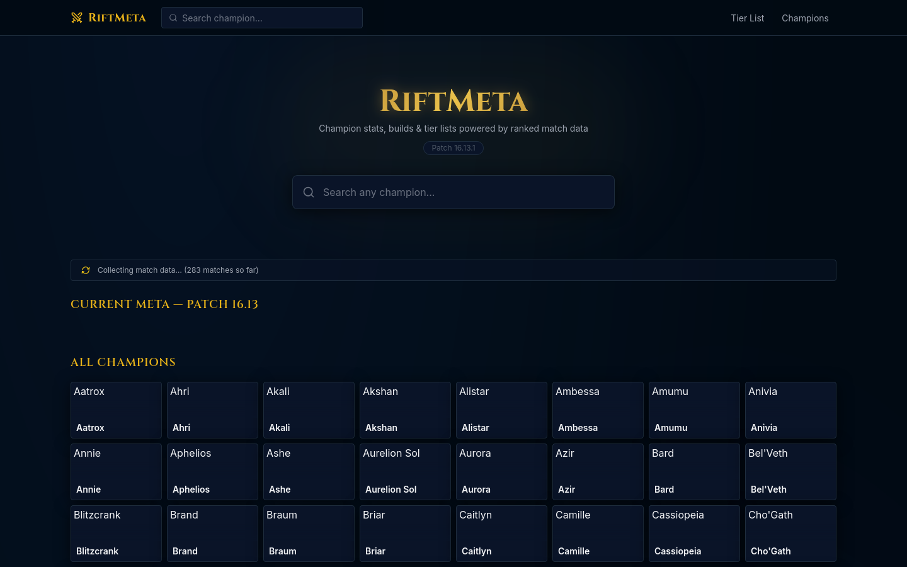

# RiftMeta

A fast, open-source League of Legends champion analytics site powered entirely by Riot's official API and Data Dragon. Search any champion and instantly see builds, runes, counters, skill order, and live patch win rates — all aggregated from real Challenger-tier ranked matches.



---

## Features

- **Instant champion search** — fuzzy search with live dropdown across all champions
- **Ranked match analytics** — win rate, pick rate, and ban rate per patch and role
- **Item builds** — most popular items ranked by pick rate and win rate with sample sizes
- **Rune pages** — best primary + secondary path combos with win rates
- **Counter picks** — who you beat, who beats you, with full matchup statistics  
- **Skill order** — inferred from cast frequency across thousands of games
- **Summoner spells** — top combo ranked by popularity and win rate
- **Tier list** — top champions by win rate, pick rate, and ban rate for the current patch
- **Role selector** — all data filterable by lane (Top / Jungle / Mid / Bot / Support)
- **Live data collection** — background worker continuously pulls fresh Challenger matches
- **Aggressive caching** — Redis-backed response cache keeps the site fast

---

## Tech Stack

| Layer | Technology |
|-------|-----------|
| Backend | Go 1.22 + Fiber v2 |
| Frontend | React 18, Vite 5, TypeScript |
| Styling | TailwindCSS 3 |
| Data fetching | TanStack Query v5, Axios |
| Cache | Redis 7 |
| Database | PostgreSQL 16 |
| Production serving | Nginx |
| Containerization | Docker Compose |

---

## How It Works

### Static data — no API key needed
Champion icons, splash art, item images, rune icons, and summoner spell icons are all served from [Riot Data Dragon](https://ddragon.leagueoflegends.com). These requests require no authentication and are cached for 6 hours.

### Match data — Riot Match-V5 API
A background Go worker:
1. Pulls the Challenger leaderboard to get high-elo player PUUIDs
2. Fetches up to 20 recent ranked solo queue matches per player
3. Aggregates per-champion statistics: items, runes, summoner spells, skill casts, and counter matchups
4. Persists aggregate data to PostgreSQL
5. Busts Redis cache keys so the next request gets fresh data

The API key **never leaves the server** — the frontend only calls `/api/*` routes on the same origin.

---

## Getting Started

### Prerequisites

- [Go 1.22+](https://go.dev/dl/)
- [Node.js 20+](https://nodejs.org)
- [Docker + Docker Compose](https://docs.docker.com/get-docker/) (recommended)
- A Riot API key from [developer.riotgames.com](https://developer.riotgames.com)

### 1. Clone the repo

```bash
git clone https://github.com/marcailagan21/RiftMeta.git
cd RiftMeta
```

### 2. Configure environment

```bash
cp .env.example .env
```

Edit `.env` and set your Riot API key:

```env
RIOT_API_KEY=RGAPI-your-key-here
```

> **Note:** Personal API keys expire every 24 hours. For a persistent deployment, apply for a Production key at [developer.riotgames.com](https://developer.riotgames.com) under "My Apps."

### 3. Run with Docker (recommended)

```bash
docker compose up --build
```

| Service | URL |
|---------|-----|
| Frontend | http://localhost:3001 |
| Backend API | http://localhost:8080 |

### 4. Trigger initial data collection

After the containers start, kick off the first match collection run:

```bash
curl -X POST http://localhost:8080/api/admin/worker/run
```

Watch progress on the home page status bar — it updates live. The first run processes ~400–600 matches (roughly 3–5 minutes). Popular champions like Jinx, Ahri, and Yasuo will have data first.

---

## Running Locally Without Docker

### Backend

```bash
cd backend
go mod download
go run ./cmd/server
# Starts on :8080
```

### Frontend

```bash
cd frontend
npm install
npm run dev
# Starts on :3000, proxies /api → :8080
```

---

## Environment Variables

| Variable | Required | Default | Description |
|----------|----------|---------|-------------|
| `RIOT_API_KEY` | Yes | — | Riot API key (`RGAPI-...`) |
| `DATABASE_URL` | Yes | — | PostgreSQL connection string |
| `REDIS_URL` | Yes | — | Redis connection URL |
| `DEFAULT_REGION` | No | `na1` | Platform routing (na1, euw1, kr, etc.) |
| `DEFAULT_ROUTING` | No | `americas` | Regional routing for match API |
| `PORT` | No | `8080` | Backend port |
| `POSTGRES_PASSWORD` | No | `riftmeta_secret` | Docker Compose DB password |

---

## API Reference

| Method | Endpoint | Description |
|--------|----------|-------------|
| `GET` | `/health` | Health check |
| `GET` | `/api/version` | Current Data Dragon version |
| `GET` | `/api/champions` | All champions (static data) |
| `GET` | `/api/champions/:id` | Single champion detail |
| `GET` | `/api/champions/:id/stats` | Win/pick/ban rates |
| `GET` | `/api/champions/:id/builds` | Item builds, skill order, summoner spells |
| `GET` | `/api/champions/:id/runes` | Rune page data |
| `GET` | `/api/champions/:id/counters` | Counter matchup data |
| `GET` | `/api/meta/top` | Top champions by win/pick/ban rate |
| `GET` | `/api/admin/worker/status` | Background worker status |
| `POST` | `/api/admin/worker/run` | Trigger a data collection run |
| `GET` | `/api/admin/ping` | Verify Riot API key is working |

All champion endpoints accept optional query params: `?role=TOP&region=na1&patch=16.13`

---

## Project Structure

```
RiftMeta/
├── backend/
│   ├── cmd/server/main.go          # Entry point
│   └── internal/
│       ├── api/
│       │   ├── router.go           # Fiber routes + middleware
│       │   └── handlers/
│       │       └── champions.go    # HTTP handlers
│       ├── cache/redis.go          # Redis client
│       ├── config/config.go        # Environment config
│       ├── db/postgres.go          # PostgreSQL + migrations
│       ├── models/models.go        # Data types
│       ├── riot/
│       │   ├── client.go           # Rate-limited Riot API client
│       │   ├── datadragon.go       # Static data fetching
│       │   └── matches.go          # Match API DTOs
│       └── worker/worker.go        # Background data aggregator
├── frontend/
│   └── src/
│       ├── api/client.ts           # API calls
│       ├── components/
│       │   ├── champion/           # Build, rune, counter, stats components
│       │   ├── common/             # Navbar, footer, shared UI
│       │   └── home/               # Search hero, tier list, worker status
│       ├── pages/
│       │   ├── Home.tsx
│       │   └── Champion.tsx
│       └── types/index.ts          # TypeScript interfaces
├── screenshots/
├── docker-compose.yml
├── .env.example
└── README.md
```

---

## Rate Limiting & Caching

The Go backend stays safely within Riot's rate limits:

- **15 requests/second** via `golang.org/x/time/rate` token bucket
- Automatic **429 backoff** with retry
- Frontend clients are limited to **60 requests/minute per IP**

Redis TTLs:

| Data | TTL |
|------|-----|
| DD version | 1 hour |
| Champion list | 6 hours |
| Stats / Builds / Runes / Counters | 30 minutes |
| Meta top champions | 15 minutes |

---

## Contributing

Contributions are welcome. See [CONTRIBUTING.md](CONTRIBUTING.md) for full guidelines.

Quick start:

```bash
git checkout -b feature/your-feature
# make changes
git commit -m "feat: describe your change"
git push origin feature/your-feature
# open a pull request
```

---

## Legal

RiftMeta isn't endorsed by Riot Games and doesn't reflect the views or opinions of Riot Games or anyone officially involved in producing or managing Riot Games properties. Riot Games, League of Legends, and all associated properties are trademarks or registered trademarks of Riot Games, Inc.

Data provided by [Riot Games Data Dragon](https://developer.riotgames.com/docs/lol#data-dragon). This project does not scrape or reproduce data from any third-party LoL statistics website.
